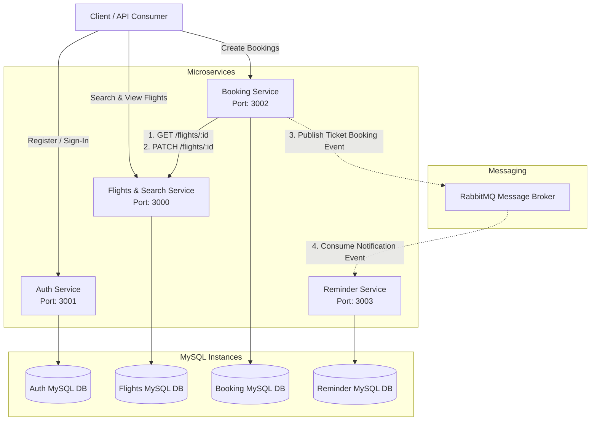

# ✈️ Airline Booking System - Backend (Microservices Architecture)

Welcome to the backend of the **Airline Booking System**, designed and implemented as a robust **Microservices Architecture**. The backend handles user authentication and role management, flight search and database assets, ticket bookings processing, and automated email reminders/notifications.

The microservices communicate with each other using:
*   **Synchronous REST APIs** (via `Axios`) for immediate operations (e.g., verifying flight details and seat capacity during the booking process).
*   **Asynchronous Message Queueing** (via `RabbitMQ`) for decoupled, event-driven processes (e.g., publishing a ticket booking event to trigger email notifications).

---

## 🏗️ System Architecture & Workflow

Here is how the client and the microservices interact:



### Flow of a Ticket Booking
1. The **Client** requests a booking via the **Booking Service** (`POST /api/v1/bookings`).
2. The **Booking Service** makes a synchronous HTTP call to the **Flights Service** to fetch flight details and verify seat availability.
3. If seats are available, the **Booking Service** calculates the total price, creates a booking with status `In Process`, and calls the **Flights Service** to update the seat capacity (`totalSeats`) of the flight.
4. Once successfully updated, the **Booking Service** sets the booking status to `Booked` and publishes a message to **RabbitMQ** indicating a booking was successful.
5. The **Reminder Service** consumes the event from **RabbitMQ** and queues a `NotificationTicket` in its database.
6. A scheduled cron job in the **Reminder Service** processes pending tickets and sends confirmation emails to the passenger.

---

## 🛠️ Technology Stack

*   **Runtime Environment**: [Node.js](https://nodejs.org/) (v16 or higher)
*   **Web Framework**: [Express.js](https://expressjs.com/) (v5.x)
*   **ORM**: [Sequelize ORM](https://sequelize.org/)
*   **Database**: [MySQL](https://www.mysql.com/)
*   **HTTP Client**: [Axios](https://axios-http.com/)
*   **Message Broker**: [RabbitMQ](https://www.rabbitmq.com/) (using `amqplib`)
*   **Scheduler**: [node-cron](https://www.npmjs.com/package/node-cron) (for automated notification worker runs)
*   **Email Engine**: [Nodemailer](https://nodemailer.com/) (using SMTP server, e.g., Gmail)

---

## 📁 Repository Structure

The backend workspace is structured as follows:

```text
AirLineBookingSystem-(Backend)/
├── README.md                                    # Root Project Documentation
├── Auth_Service-master/                         # Authentication & User Directory
│   └── Auth_Service-master/                     # Node.js Project Root for Auth Service
├── FlightsAndSearchService-master/              # Flights, Cities, and Airports Directory
│   └── FlightsAndSearchService-master/          # Node.js Project Root for Flights Service
├── AirTicketBookingService-master/              # Ticket booking & RabbitMQ publisher Directory
│   └── AirTicketBookingService-master/          # Node.js Project Root for Booking Service
└── ReminderService-master/                      # Email / Notification Worker Directory
    └── ReminderService-master/                  # Node.js Project Root for Reminder Service
```

---

## 🔌 Microservices Detail & Endpoints

### 1. 🔑 Authentication Service (`Auth_Service`)
Responsible for managing user profiles, bcrypt password hashing, token signatures (JWT), and roles.

*   **Database Models**:
    *   `User`: Keeps track of user credentials (`email`, hashed `password`).
    *   `Role`: Defines authorization categories (`ADMIN`, `USER`).
    *   `User_Roles`: Joint/junction table for many-to-many relationship.
*   **Key APIs**:
    *   `POST /api/v1/signup`: Creates a new user account.
    *   `POST /api/v1/signin`: Authenticates credentials, returns a JWT token.
    *   `GET /api/v1/isAuthenticated`: Validates incoming JWT headers.
    *   `GET /api/v1/isAdmin`: Verifies whether user roles contain ADMIN privileges.

---

### 2. 🗺️ Flights & Search Service (`FlightsAndSearchService`)
Handles airplane inventories, airports, cities, and flight schedules.

*   **Database Models**:
    *   `City`: Represents cities (`name`).
    *   `Airport`: Represents airports (`name`, `address`, `cityId`).
    *   `Airplane`: Represents airplanes (`modelNumber`, `capacity`).
    *   `Flights`: Represents schedules (`flightNumber`, `airplaneId`, `departureAirportId`, `arrivalAirportId`, `arrivalTime`, `departureTime`, `price`, `totalSeats`).
*   **Key APIs**:
    *   `POST /api/v1/city`: Adds a new city.
    *   `GET /api/v1/city`: Returns a list of cities.
    *   `GET /api/v1/city/:id`: Returns city details.
    *   `PATCH /api/v1/city/:id`: Modifies a city.
    *   `DELETE /api/v1/city/:id`: Deletes a city.
    *   `POST /api/v1/airports`: Registers airports.
    *   `POST /api/v1/flights`: Configures schedules. Runs validations (arrival > departure).
    *   `GET /api/v1/flights`: Queries schedules using query-filters (departure, arrival, price range).

---

### 3. 🎫 Booking Service (`AirTicketBookingService`)
Maintains transactions and communicates with Flights Service to purchase seats.

*   **Database Models**:
    *   `Booking`: Records order status (`flightId`, `userId`, `status` [In Process | Booked | Cancelled], `noOfSeats`, `totalCost`).
*   **Key APIs**:
    *   `POST /api/v1/bookings`: Checks availability, books tickets, updates inventory in the Flights Service, and publishes success events to RabbitMQ.
    *   `POST /api/v1/publish`: Custom test route for publishing direct payloads to RabbitMQ.

---

### 4. ✉️ Reminder Service (`ReminderService`)
Retrieves notification events from RabbitMQ and runs scheduled background cron processes to dispatch emails.

*   **Database Models**:
    *   `NotificationTicket`: Represents scheduled emails (`subject`, `content`, `recepientEmail`, `status` [PENDING | SUCCESS | FAILED], `notificationTime`).
*   **Features**:
    *   Sends emails using `nodemailer`.
    *   Automated checking of `PENDING` notifications matching current time via `node-cron`.

---

## ⚙️ Environment Variables and DB Config Setup

In each nested project folder (e.g. `Auth_Service-master/Auth_Service-master/`), we have preconfigured:
1. `.env` files for environment variables.
2. `src/config/config.json` for database connection credentials.

Ensure you update these config files in each folder with your own MySQL credentials:

### Database Config (`src/config/config.json`)
```json
{
  "development": {
    "username": "root",
    "password": "your_mysql_password",
    "database": "database_name",
    "host": "127.0.0.1",
    "dialect": "mysql"
  }
}
```

### Environment Configurations (`.env`)

#### `Auth_Service`
```env
PORT=3001
JWT_KEY=AIRLINE_SYSTEM_SECRET_KEY
DB_SYNC=true
```

#### `FlightsAndSearchService`
```env
PORT=3000
SYNC_DB=true
```

#### `AirTicketBookingService`
```env
PORT=3002
FLIGHT_SERVICE_PATH=http://localhost:3000
MESSAGE_BROKER_URL=amqp://localhost
EXCHANGE_NAME=BOOKING_SYSTEM_EXCHANGE
REMINDER_BINDING_KEY=REMINDER_QUEUE
DB_SYNC=true
```

#### `ReminderService`
```env
PORT=3003
EMAIL_ID=your_gmail_address@gmail.com
EMAIL_PASS=your_gmail_app_password
DB_SYNC=true
```

---

## 🚀 How to Run the Project

### 1. Prerequisites
Ensure you have the following services up and running:
*   [Node.js](https://nodejs.org/) (v16+)
*   [MySQL Server](https://www.mysql.com/)
*   [RabbitMQ Server](https://www.rabbitmq.com/) (Running on port 5672 by default)

### 2. Database Creation
Create 4 separate databases in your MySQL schema:
1. `auth_service_db`
2. `flights_service_db`
3. `booking_service_db`
4. `reminder_service_db`

### 3. Installation & Database Migrations
For **each** microservice, go to its inner directory and execute the setup commands:

```bash
# Example for Flights and Search Service
cd FlightsAndSearchService-master/FlightsAndSearchService-master
npm install
npx sequelize-cli db:migrate
npx sequelize-cli db:seed:all
```

Repeat the `npm install` and `npx sequelize-cli db:migrate` command for:
*   `Auth_Service-master/Auth_Service-master`
*   `AirTicketBookingService-master/AirTicketBookingService-master`
*   `ReminderService-master/ReminderService-master`

### 4. Running Dev Servers
To spin up all services, run the following in each of their directories:
```bash
npm start
```

---

## 👨‍💻 Author Information

*   **Name**: Ujjwal Kumar
*   **Email**: [123ujjwal.kr@gmail.com](mailto:123ujjwal.kr@gmail.com)
*   **Institution**: IIIT Ranchi
